# DevOps Assignment - CA1

**Author:** Fernando Moreira

**Date:** 24/02/2025

**Discipline:** DevOps

**Program:** SWitCH DEV

**Institution:** ISEP - Instituto Superior de Engenharia do Porto

## Table of Contents

- [Introduction](#introduction)
- [Part 1: Version Control with Git](#part-1-version-control-with-git)
    - [1. Create a Repository on GitHub](#1-create-a-repository-on-github)
    - [2. Create the Local Folder on Your Computer](#2-create-the-local-folder-on-your-computer)
    - [3. Initialize the Local Repository and Create README.md](#3-initialize-the-local-repository-and-create-readmemd)
    - [4. Add the Remote Repository and Push Your Changes](#4-add-the-remote-repository-and-push-your-changes)
    - [5. Cloning the Tutorial Repository and Organizing the Structure](#5-cloning-the-tutorial-repository-and-organizing-the-structure)
    - [6. Create Tag `v1.1.0`](#6-create-tag-v110)
- [Managing Issues and Implementing Features](#managing-issues-and-implementing-features)
    - [1. Install GitHub CLI (gh)](#1-install-github-cli-gh)
    - [2. Create an Issue on GitHub](#2-create-an-issue-on-github)
    - [3. Add Comments to the Issue](#3-add-comments-to-the-issue)
    - [4. Implement the `jobYears` field in the `Employee` Class](#4-implement-the-jobyears-field-in-the-employee-class)
    - [5. Unit Tests](#5-unit-tests)
    - [6. Update React Components](#6-update-react-components)
    - [7. Debug with React Developer Tools](#7-debug-with-react-developer-tools)
    - [8. Close the Issue with a Commit](#8-close-the-issue-with-a-commit)
    - [9. Create Tag `v1.2.0`](#9-create-tag-v120)
    - [10. Finalize the Assignment with Tag `ca1-part1.1`](#10-finalize-the-assignment-with-tag-ca1-part11)
- [Part 2: Development Using Branches](#part-2-development-using-branches)
    - [1. Goals and Requirements](#1-goals-and-requirements)
    - [2. Key Developments](#2-key-developments)
    - [3. Integration and Testing of the Email Field](#3-integration-and-testing-of-the-email-field)
    - [4. Merging into Master](#4-merging-into-master)
    - [5. Create a New Branch to Fix a Bug](#5-create-a-new-branch-to-fix-a-bug)
    - [6. validateEmail Method](#6-validateemail-method)
    - [7. Validation Showcase](#7-validation-showcase)
- [Alternative Solution with Mercurial and SourceForge](#alternative-solution-with-mercurial-and-sourceforge)
    - [1. Create a Repository on SourceForge](#1-create-a-repository-on-sourceforge)
    - [2. Install Mercurial](#2-install-mercurial)
    - [3. Initialize a Local Repository](#3-initialize-a-local-repository)
    - [4. Add Files and Make the First Commit](#4-add-files-and-make-the-first-commit)
    - [5. Create a .hgignore File](#5-create-a-hgignore-file)
    - [6. Move the Basic Folder to Local Repository](#6-move-the-basic-folder-to-local-repository)
    - [7. Link Your Local Repository with SourceForge](#7-link-your-local-repository-with-sourceforge)
    - [8. Push Code to SourceForge](#8-push-code-to-sourceforge)
    - [9. Create a Branch](#9-create-a-branch)
    - [10. Switch Between Branches](#10-switch-between-branches)
    - [11. Create and Push Tags](#11-create-and-push-tags)
    - [12. Merge Branch Back to Default (Main) Branch](#12-merge-branch-back-to-default-main-branch)
    - [13. View the Commit History with hg log](#13-view-the-commit-history-with-hg-log)
- [Conclusion](#conclusion)

## Introduction

This tutorial is designed to guide you through essential practices in version control, project management, and software development workflows using Git, GitHub, Mercurial, and SourceForge. Whether you are a beginner or looking to enhance your existing knowledge, this guide covers a range of topics that will help you manage your codebase, collaborate with others, and ensure high-quality software delivery.

- **Version Control with Git**: We begin by introducing Git and GitHub, the most widely used tools for version control and collaborative development. You will learn how to create repositories, initialize local repositories, and push changes to GitHub, alongside best practices for managing versions with tags and branches.

- **Managing Issues and Implementing Features**: Using GitHub's issue tracking system, you will learn how to create and manage issues, implement new features, and update React components while testing your code with unit tests to ensure quality.

- **Alternative Solution with Mercurial and SourceForge**: For those interested in an alternative to Git, we also explore Mercurial as a version control system and SourceForge as a remote repository. You will learn how to set up, manage, and push changes using Mercurial, making this guide suitable for those working in various development environments.

This tutorial will equip you with the knowledge and practical skills to manage your projects, collaborate with teammates, and maintain a robust development workflow.

---

## Part 1: Version Control with Git

### 1. Create a Repository on GitHub

First, create a repository on GitHub to store your project:

1. Go to [GitHub](https://github.com) and log in to your account.
2. Click on **New** to create a new repository.
3. Name the repository `devops-24-25-1241905`.
4. Click **Create repository**.

### 2. Create the Local Folder on Your Computer

Create a local folder where your project will reside. Open a terminal and run:

```bash
mkdir ~/DevOps
cd ~/DevOps
```

### 3. Initialize the Local Repository and Create README.md

Initialize the local Git repository and create the `README.md` file:

```bash
mkdir -p DevOps/devops-24-25-1241905/CA1/part1
echo "# devops-24-25-1241905" >> DevOps/devops-24-25-1241905/CA1/README.md
git init
git add DevOps/devops-24-25-1241905/CA1/README.md
git commit -m "first commit"
```

### 4. Add the Remote Repository and Push Your Changes

Link the local repository to the remote GitHub repository and push the initial commit:

```bash
git remote add origin https://github.com/fmoreira13/devops24-25-1241905.git
git branch -M main
git push -u origin main
```

---

## Cloning the Tutorial Repository and Organizing the Structure

### 1. Clone the React.js and Spring Data REST Tutorial Repository

Clone the tutorial repository at https://github.com/spring-attic/tut-react-and-spring-data-rest :

```bash
mkdir ~/git-tutorial
cd ~/git-tutorial
git clone https://github.com/fmoreira13/tutorial-reactjs-spring-data-rest.git
```


### 2. Move the `basic` folder to `part1`

Move the `basic` directory (from the cloned tutorial repository) into the `part1` folder:

```bash
mv ~/git-tutorial/tut-react-and-spring-data-rest/basic ~/DevOps/devops-24-25-1241905/CA1/part1/
```

Don't forget copy the global `pom.xml` from the cloned repository to the `part1` directory:

```bash
cp ~/git-tutorial/tut-react-and-spring-data-rest/pom.xml ~/DevOps/devops-24-25-1241905/CA1/part1/
```

The global pom.xml is located at the root of the cloned repository. You need to copy it to the `part1` directory so that the global dependencies and configurations are properly applied.

### 3. Create the `.gitignore` File

In the `part1` directory, create a `.gitignore` file to exclude unnecessary files from being tracked by Git. Here is a basic `.gitignore`:

```
node_modules/
*.log
*.env
```
### 4. Create Tag `v1.1.0`

After organizing your files, create a version tag `v1.1.0` to mark this step:

```bash
git tag -a v1.1.0 -m "Initial setup and file organization"
```

---

## Managing Issues and Implementing Features

### 1. Install GitHub CLI (gh)

The GitHub CLI (`gh`) allows you to interact with GitHub directly from the terminal. Install it on macOS using Homebrew:

```bash
brew install gh
```

After installation, authenticate with your GitHub account:

```bash
gh auth login
```

### 2. Create an Issue on GitHub

Create an issue to add a new field (`jobYears`) to the application:

```bash
gh issue create --title "new feature to add a new field to the application" --body "add a new field to record the years of the employee in the company" --label "enhancement"
```

### 3. Add Comments to the Issue

You can add comments to the issue for further clarification. Use the following command to add a comment to issue #1:

```bash
gh issue comment 1 --body "To do this, I have to go to the Employee Class in the application src"
```

### 4. Implement the `jobYears` field in the `Employee` Class

The goal of this phase was to add the `jobYears` field to track an employee’s years at the company. I also implemented unit tests to ensure `Employee` creation and attribute validation, enforcing integer-only values for jobYears and preventing null or empty String fields.

Add the new `jobYears` attribute to the `Employee` class and update the following methods:

- Constructor
- `equals` method
- `hashCode` method
- `toString` method
- Any other necessary methods

```java
public class Employee {
    
    private @Id @GeneratedValue Long id; // <2>
    private String firstName;
    private String lastName;
    private String description;
    private int jobYears;

    protected Employee() {}

    public Employee(String firstName, String lastName, String description, int jobYears) {
        this.firstName = validateName(firstName);
        this.lastName = validateLastName(lastName);
        this.description = validateDescription(description);
        this.jobYears = validateJobYears(jobYears);}

    private String validateName(String name) {
        if (name == null || name.trim().isEmpty())
            throw new IllegalArgumentException(name + " cannot be null or blank");
        return name;}

    private String validateLastName(String lastName) {
        if (lastName == null || lastName.trim().isEmpty())
            throw new IllegalArgumentException(lastName + " cannot be null or blank");
        return lastName;}

    private String validateDescription(String description) {
        if (description == null || description.trim().isEmpty())
            throw new IllegalArgumentException("Description cannot be null or blank");
        return description;}

    private int validateJobYears(int jobYears) {
        if (jobYears < 0)
            throw new IllegalArgumentException("Job years must be non-negative");
        return jobYears;}
    
    @Override
    public boolean equals(Object o) {
        if (this == o) return true;
        if (o == null || getClass() != o.getClass()) return false;
        Employee employee = (Employee) o;
        return  Objects.equals(id, employee.id) && Objects.equals(firstName, employee.firstName) &&
                Objects.equals(lastName, employee.lastName) && Objects.equals(description, employee.description) &&
                Objects.equals(jobYears, employee.jobYears);}

    @Override
    public int hashCode() {return Objects.hash(id, firstName, lastName, description, jobYears);}

    public Long getId() {return id;}
    public void setId(Long id) {this.id = id;}
    public String getFirstName() {return firstName;}
    public void setFirstName(String firstName) {this.firstName = firstName;}
    public String getLastName() {return lastName;}
    public void setLastName(String lastName) {this.lastName = lastName;}
    public String getDescription() {return description;}
    public void setDescription(String description) {this.description = description;}
    public int getJobYears() {return jobYears;}
    public void setJobYears(int jobYears) {this.jobYears = jobYears;}

    @Override
    public String toString() {
        return "Employee{" + "id=" + id + ", firstName='" + firstName + '\'' +
                ", lastName='" + lastName + '\'' + ", description='" + description + '\'' +
                ", jobYears=" + jobYears + '\'' + '}';}
}

```

Also, update the `DatabaseLoader` class to handle the new `jobYears` field. The `DatabaseLoader` class, which pre-loads the database with sample data, was updated to include `jobYears` for sample employees. This ensures the new field is functional from the start.

```java
public class DatabaseLoader implements CommandLineRunner { // <2>

	private final EmployeeRepository repository;

	@Autowired // <3>
	public DatabaseLoader(EmployeeRepository repository) {
		this.repository = repository;
	}

	@Override
	public void run(String... strings) throws Exception { // <4>
		this.repository.save(new Employee("Frodo", "Baggins", "ring bearer", 7));
		this.repository.save(new Employee("Fernando", "Moreira", "ogre", 15));
		this.repository.save(new Employee("Joaquim", "Santos", "the teacher", 50));
		this.repository.save(new Employee("Paulo", "Matos", "one more teacher", 50));

	}
}
```

### 5. Unit Tests

Write unit tests for the `Employee` class to validate its functionality, particularly for handling null and empty values. Here's an example test case:

```java
    @Test
    void testEmployeeNullValues() {
        
        // Arrange
        String firstName = "Frodo";
        String lastName = "Baggins";
        String description = "ring bearer";
        int jobYears = 5;
        
        // Act & Assert
        assertThrows(IllegalArgumentException.class, () -> new Employee(null, lastName, description, jobYears));
        assertThrows(IllegalArgumentException.class, () -> new Employee(firstName, null, description, jobYears));
        assertThrows(IllegalArgumentException.class, () -> new Employee(firstName, lastName, null, jobYears));
    }
```

### 6. Update React Components

The React components in `app.js` were updated to display the `jobYears` field in the employee list. The `EmployeeList` and `Employee` components now include a "Job Years" column, allowing users to see an employee's tenure alongside other details.

```javascript
class EmployeeList extends React.Component{
    render() {
        const employees = this.props.employees.map(employee =>
            <Employee key={employee._links.self.href} employee={employee}/>
        );
        return (
            <table>
                <tbody>
                    <tr>
                        <th>First Name</th>
                        <th>Last Name</th>
                        <th>Description</th>
                        <th>Job Years</th>
                    </tr>
                    {employees}
                </tbody>
            </table>
        )
    }
}
```

```javascript
class Employee extends React.Component{
    render() {
        return (
            <tr>
                <td>{this.props.employee.firstName}</td>
                <td>{this.props.employee.lastName}</td>
                <td>{this.props.employee.description}</td>
                <td>{this.props.employee.jobYears}</td>
            </tr>
        )
    }
}
```

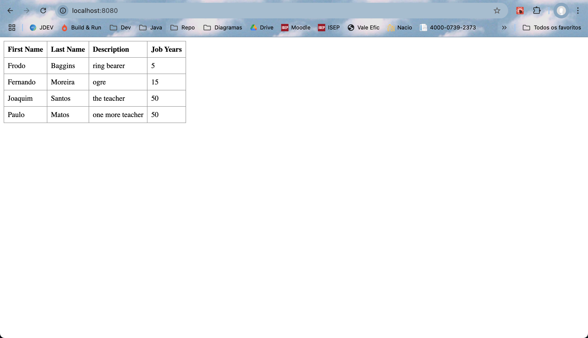

### 7. Debug with React Developer Tools

Use the React Developer Tools to debug the frontend of your application and ensure the new field (`jobYears`) is displayed correctly.
Run the application with `./mvnw spring-boot:run` to test its functionality at http://localhost:8080/. This hands-on testing ensured proper operation and compatibility.
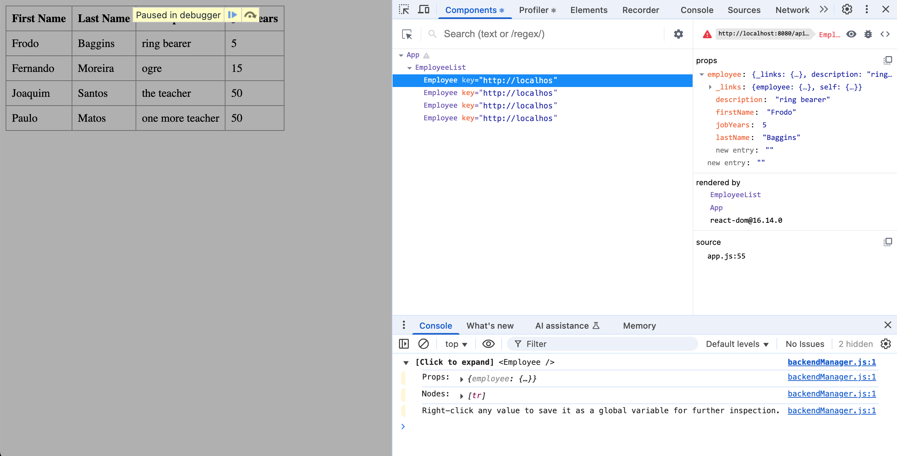


### 8. Close the Issue with a Commit

Once the task is completed and tested, commit the changes and close the issue with the following command:

```bash
git commit -m "Add other employees to show in localhost, closes #1"
```

### 9. Create Tag `v1.2.0`

Create a tag `v1.2.0` to mark the completion of the feature:

```bash
git tag -a v1.2.0 -m "Issue 1 completed: new field jobYears created and tested to the application"
```

### 10. Finalize the Assignment with Tag `ca1-part1.1`

Finally, create a tag `ca1-part1.1` to mark the completion of Part 1 of the assignment:

```bash
git tag ca1-part1.1 -m "Finalizing CA1 Part 1.1"
```
---

---
## Part 2: Development Using Branches

### 1. Goals and Requirements
This phase focused on using branches for feature development and bug fixes, ensuring isolated development and controlled merges. Feature branches prevented disruptions to the main codebase, and successful merges led to version tagging in the master branch.
### 2. Key Developments
Branch-based development was introduced to enhance features and fix bugs while maintaining master branch stability. Since steps were similar to Part 1, only key changes are highlighted:
For the email field, a dedicated branch `email-field` was created and switched to before development. The following commands were used:
```bash
git branch email-field
git checkout email-field
git branch
```
### 3. Integration and Testing of the Email Field
The implementation of the email field followed the same approach as the `jobYears` field:

- Code Implementation: The `Employee` class was updated to include the email field, ensuring integration across data models, forms, and views.
- Unit Testing: Tests were written to validate email creation and enforce constraints like non-null and non-empty values.
- Debugging: The application was tested on both server and client sides to resolve any issues and ensure smooth functionality.

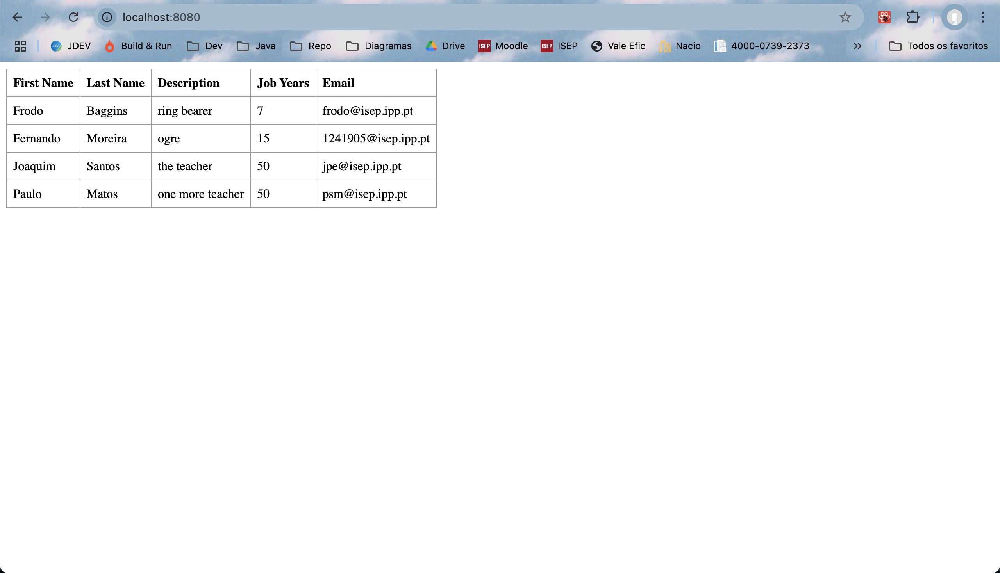

### 4. Merging into Master
After finalizing the email feature, changes were committed and pushed to the email-field branch. A no-fast-forward merge was performed to maintain history, followed by pushing updates to the remote repository and tagging the new version. The commands used:
```shell
# Commit the feature changes:
git add .
git commit -m "create branch email-field, add nem field email, validations and tests"

# Push the feature branch upstream:
git push -u origin email-field

# Switch to the main branch and merge changes:
git checkout main
git merge --no-ff email-field

# Push the merged changes to update the main branch:
git push

# Tag the new version and push the tag:
git tag -a v1.3.0 -m "v1.3.0"
git push origin v1.3.0
```
---

### Create a New Branch to Fix a Bug

In fixing the email validation bug in the `Employee` class, a branch called `fix-invalid-email` was created, following the same workflow as previous feature developments. The process involved development, testing, and merging steps, with a focus on preserving code quality and stability.

### 1. validadeEmail Method
The bug fix focused on improving the email validation logic in the `Employee` class to ensure it properly checks for the presence of an "@" symbol. The code snippet below shows the added validation logic:
```java
private String validateEmail(String email) {
		if (email == null || email.trim().isEmpty()) {
			throw new IllegalArgumentException("Email cannot be null or blank");
		}

		String emailRegex = "^[A-Za-z0-9._%+-]+@[A-Za-z0-9.-]+\\.[A-Za-z]{2,}$";

		if (!email.toLowerCase().matches(emailRegex)) {
			throw new IllegalArgumentException("Email must have a valid format with '@' before the domain and a proper domain after '@'");
		}

		return email.toLowerCase();
	}
```
### 2. Validation Showcase

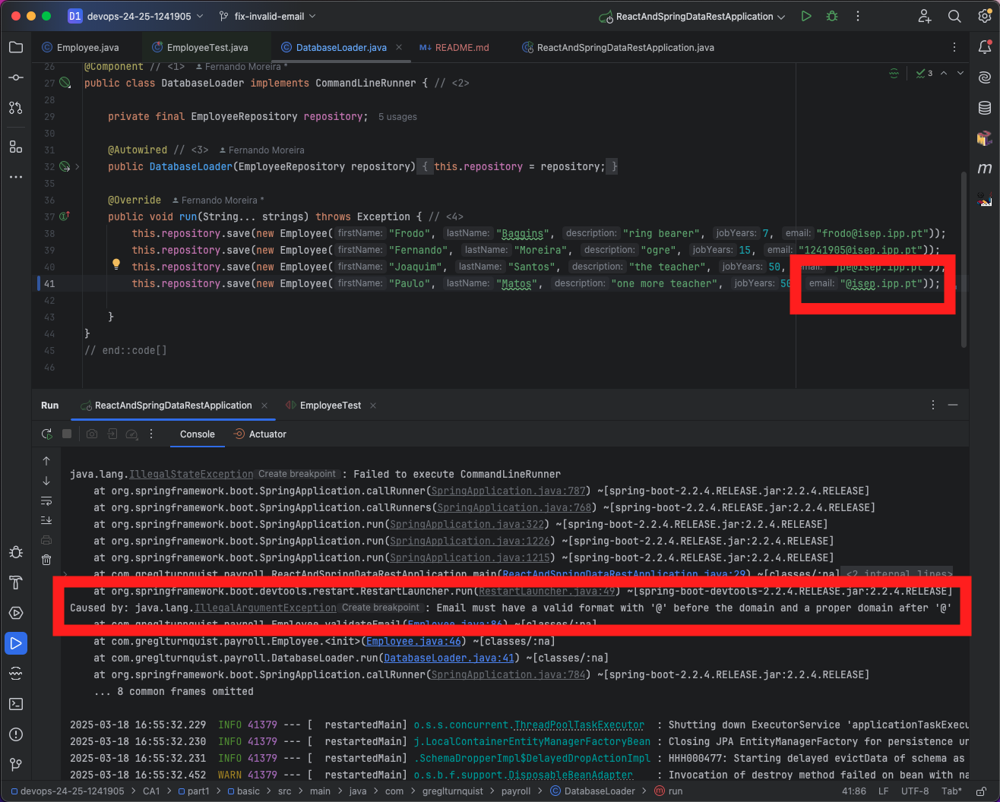

The error occurred during application startup due to an invalid email format in the `Employee` class. Specifically, the `validateEmail` method threw an IllegalArgumentException because the email did not meet the required format (missing "@" or invalid domain). This prevented the CommandLineRunner from executing, causing the application to fail.

Solution: Ensure the email provided follows the correct format with a valid "@" and domain.

---

# Alternative Solution with Mercurial and SourceForge

## Part 1: Using Mercurial and SourceForge

### 1. Create a Repository on SourceForge
- First, create a SourceForge account if you don’t have one already. Visit [SourceForge](https://sourceforge.net/) and sign up.
- After logging in, navigate to your profile, then click on **Create a New Project**.
- Fill in the required details, such as the project name, description, and choose **Mercurial** as the version control system.
- Once your project is created, SourceForge will provide you with a URL for the repository (e.g., `https://fmoreira13@hg.code.sf.net/p/devops-24-25-1241905/code`).

### 2. Install Mercurial
- Download and install Mercurial from [mercurial-scm.org](https://www.mercurial-scm.org/).
- After installation, verify that it's working correctly with the command:
  ```bash
  hg --version
  ```

### 3. Initialize a Local Repository
- In your project directory, run:
  ```bash
  hg init
  ```
  This creates a local repository in your working directory.

### 4. Add Files and Make the First Commit
- Add the files to Mercurial:
  ```bash
  hg add
  ```
- Make the first commit:
  ```bash
  hg commit -m "First commit"
  ```

### 5. Create a `.hgignore` File
Create a `.hgignore` file in your project directory to specify files and directories Mercurial should ignore. For example, you can add the following lines to the `.hgignore` file:

```bash
echo "*.log" > .hgignore
echo "*.class" >> .hgignore
echo "node_modules/" >> .hgignore
```

### 6. Move the `basic` folder to Local Repository

Move the `basic` directory from the cloned tutorial repository (like `Part 1`os this assignment):

```bash
mv ~/git-tutorial/tut-react-and-spring-data-rest/basic ~/DevOpsMercurial/devops-24-25-1241905
```

Don't forget copy the global `pom.xml` from the cloned repository:

```bash
cp ~/git-tutorial/tut-react-and-spring-data-rest/pom.xml ~/DevOpsMercurial/devops-24-25-1241905
```

The global pom.xml is located at the root of the cloned repository. You need to copy it to the project so that the global dependencies and configurations are properly applied.

### 7. Link Your Local Repository with SourceForge
- To link your local Mercurial repository to the SourceForge repository, use the `hg remote add` command with the URL provided by SourceForge:
  ```bash
  hg remote add origin https://fmoreira13@hg.code.sf.net/p/devops-24-25-1241905/code
  ```
  This sets up SourceForge as the remote for your local Mercurial repository.

### 8. Push Code to SourceForge
- Push your changes to the remote SourceForge repository:
  ```bash
  hg push origin
  ```
  This will upload your local commits to SourceForge, making them available on the remote repository.

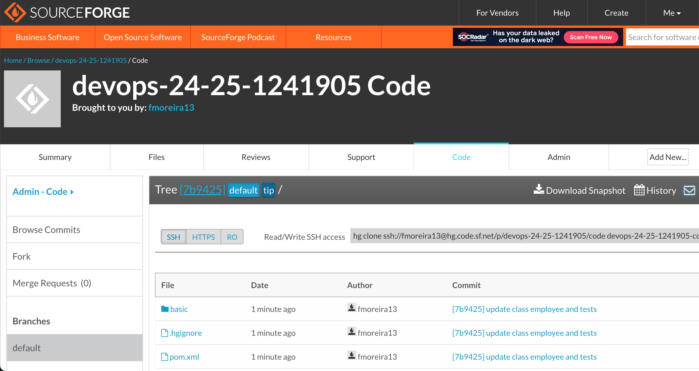

### 9. Create a Branch
- Create a new branch for development work:
  ```bash
  hg branch outra-branch
  ```
  This will mark your working directory as part of the `outra-branch`.
- Commit changes to the new branch:
  ```bash
  hg commit -m "Started feature-branch development"
  ```

### 10. Switch Between Branches
- To switch between branches, use the `hg update` command followed by the branch name:
  ```bash
  hg update outra-branch
  ```
  This command switches your working directory to the specified branch.

### 11. Create and Push Tags
- Create a tag to mark a specific point in your project:
  ```bash
  hg tag v1.0
  ```
- Push your local tags to the remote repository:
  ```bash
  hg push --tags
  ```

### 12. Merge Branch Back to Default (Main) Branch
- Once the work on your feature branch is complete, merge it back into the default (main) branch:
  ```bash
  hg update default
  hg merge outra-branch
  hg commit -m "Merged outra-branch into default"
  ```

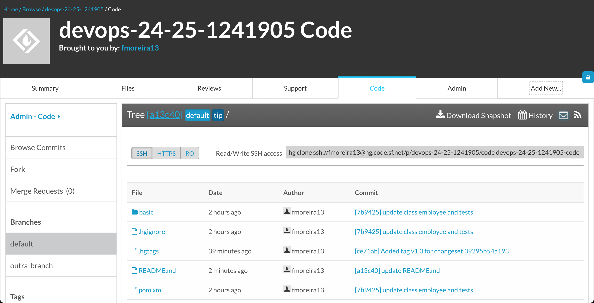

### 13. View the Commit History with `hg log`
To view the commit history of your repository, use the `hg log` command. This will display the list of commits, along with details such as the commit ID, author, date, and commit message.

Run the following command in your project directory:

```bash
hg log
```

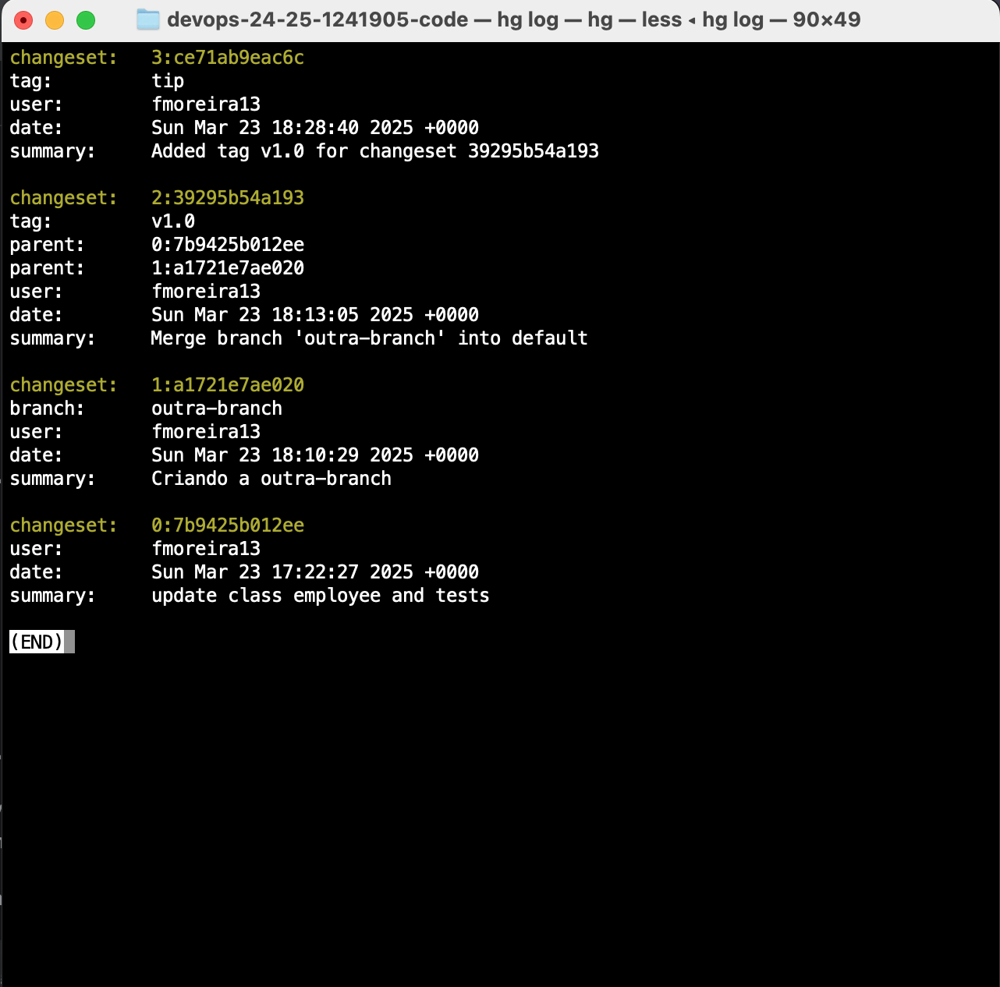

By using **Mercurial branches** and **tags**, and linking to **SourceForge**, you can efficiently manage different features or releases within your project and track the project’s progress with versioned milestones on SourceForge.

---

## Part 2: Build Tools with Gradle

### 1. Environment Setup

A new directory `/CA2/Part1` was created for the assignment, followed by cloning the example application from the provided Bitbucket repository. The repository included a `build.gradle` file and the Gradle Wrapper, ensuring a consistent setup across different environments. The project was then imported into an Integrated Development Environment (IDE) with Gradle support, enabling access to built-in tools and features. To confirm that the setup was correct, a Gradle build was executed. This step ensured that all dependencies were properly installed and that the project was ready for further development. With these preparations complete, the environment was set up for the next phases of the assignment.

Clone the example project repository:
```bash
git clone https://bitbucket.org/pssmatos/gradle_basic_demo.git
```
Remove the .git folder to avoid conflicts:
```bash
rm -rf gradle_basic_demo/.git
```

#### Gradle Basic Demo
The Gradle Basic Demo offered a hands-on experience with a multi-threaded chat server designed to manage multiple client connections simultaneously.

To set up for execution, we have to run from the project's root directory:
```bash
./gradlew build
```
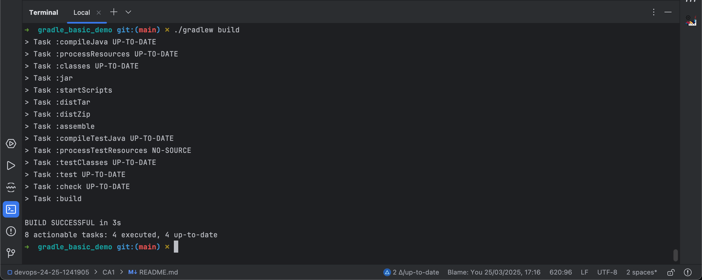

Next, the chat server was started using the command:
```bash
java -cp build/libs/basic_demo-0.1.0.jar basic_demo.ChatServerApp 59001
```
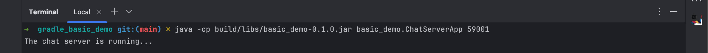

On the client side, connections to the chat server were established by running:
```bash
./gradlew runClient
```
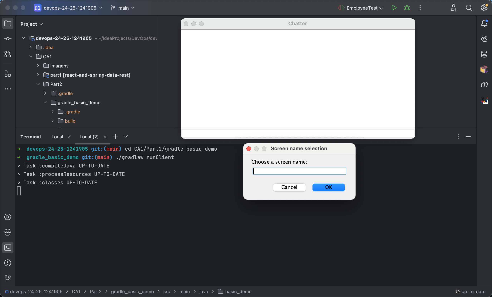

Each client successfully connected to localhost on port 59001. The `build.gradle` file was configured to allow easy adjustments for different connection settings. To showcase the server's capability of handling multiple clients, several client instances were launched in separate terminal windows. 

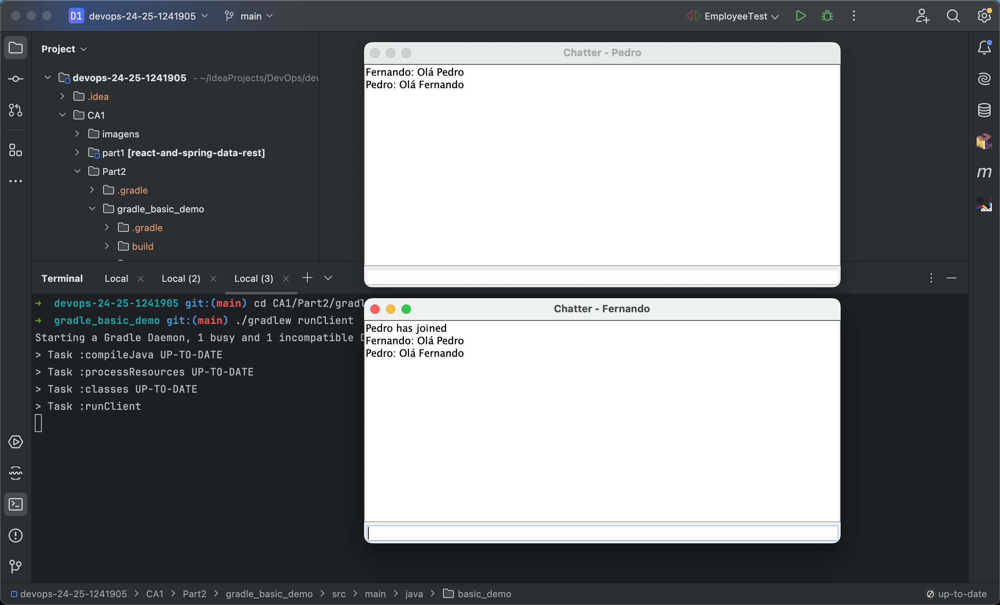

### 2. Adding a New Task to Run the Server

We need to add a Gradle task to run the server directly via Gradle.
Open the `Part2/gradle_basic_demo/build.gradle` file and add the following task at the end:

```gradle
tasks.register('runServer', JavaExec) {
    mainClass = 'basic_demo.ChatServerApp'
    classpath = sourceSets.main.runtimeClasspath
    args '59001' // Define the server port
}
```

#### Running the Server with Gradle
```
./gradlew runServer
```

### 3. Creating a Unit Test and Configuring Gradle to Run It
The project structure already includes the main directory inside src, where the source code resides.
We will now create the test directory for unit tests.
```bash
mkdir -p src/test/java/basic_demo
```

#### Project Directory Structure
```css
gradle_basic_demo
├── build.gradle
├── gradle
├── gradlew
├── gradlew.bat
├── settings.gradle
├── src
│   ├── main
│   │   └── java
│   │       └── basic_demo
│   │           └── App.java
│   └── test
│       └── java
│           └── basic_demo
│               └── AppTest.java
└── README.md
```

#### Configuring build.gradle
Ensure that `JUnit` is configured in `build.gradle`.
If not, add the following dependency:

```gradle
dependencies {
    implementation 'org.apache.logging.log4j:log4j-api:2.11.2'
    implementation 'org.apache.logging.log4j:log4j-core:2.11.2'

    testImplementation 'junit:junit:4.12'
}
```

#### Creating the Test Class (AppTest.java)
Navigate to the test directory:
```bash
cd src/test/java/basic_demo
touch AppTest.java
```
Add the following test code inside AppTest.java:
```java
package basic_demo;

import org.junit.Test;
import static org.junit.Assert.*;

public class AppTest {
    @Test
    public void testAppHasAGreeting() {
        App classUnderTest = new App();
        assertNotNull("app should have a greeting", classUnderTest.getGreeting());
    }
}
```

#### Running Tests
To run all tests using Gradle, execute:
```bash
./gradlew test
```
If everything is configured correctly, Gradle will compile the tests, execute them, and display the results in the terminal.

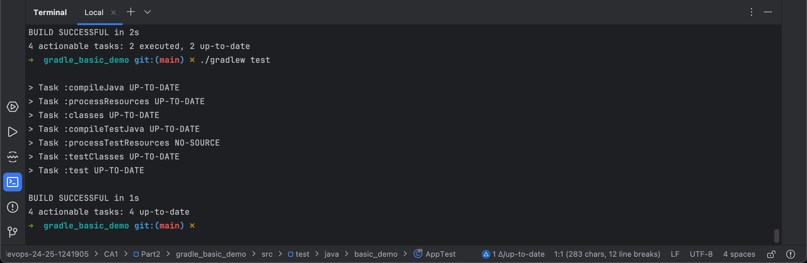


---

### Conclusion

This tutorial provided a comprehensive guide to using version control systems, focusing on Git, to manage and develop a project effectively.

- **Version Control with Git**: We started by exploring the basics of Git and GitHub, covering repository creation, initialization, and pushing changes to the cloud. Additionally, we delved into the process of tagging versions, managing issues, and implementing new features with the integration of React components and unit tests.

- **Development Using Branches**: We explored the power of branching for feature development, bug fixes, and testing, ensuring code stability with proper versioning and integration.

- **Alternative Solution with Mercurial and SourceForge**: For those preferring Mercurial, we walked through a step-by-step guide to initialize a repository, link it to SourceForge, and push changes. This offered an alternative for managing the project and collaborating efficiently with remote repositories.

By the end of this tutorial, you should be well-equipped to manage version control in a variety of development environments, use Git or Mercurial to track changes, and utilize issue tracking and branching for effective project management. Whether using GitHub or SourceForge, these practices are essential for modern software development.

