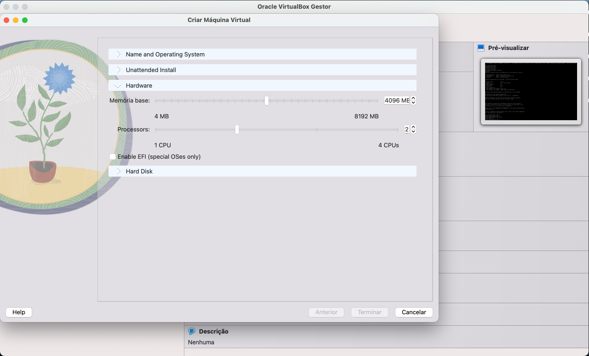
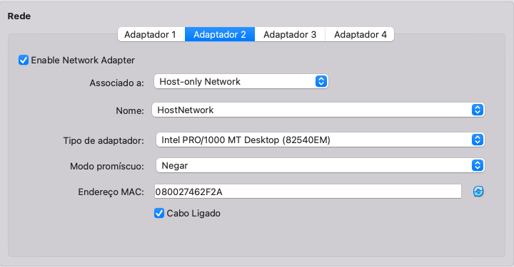
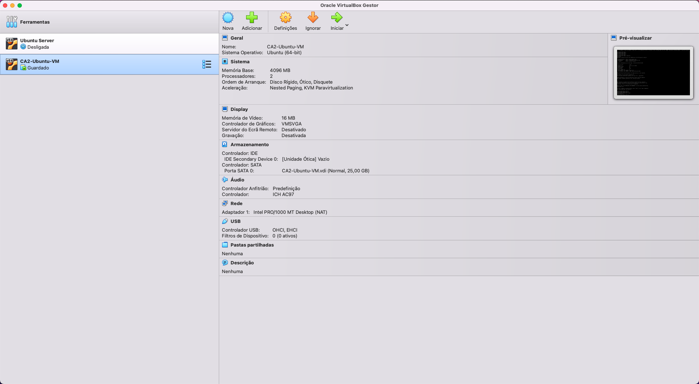
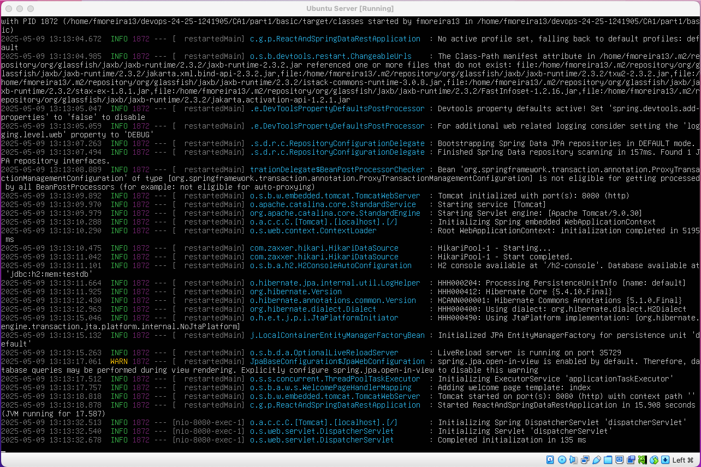
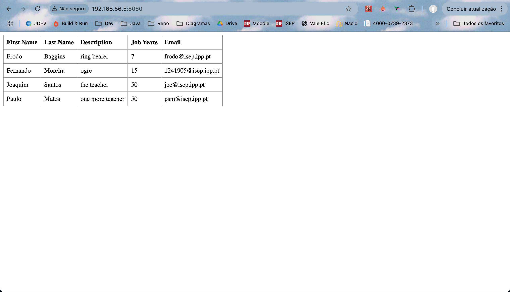
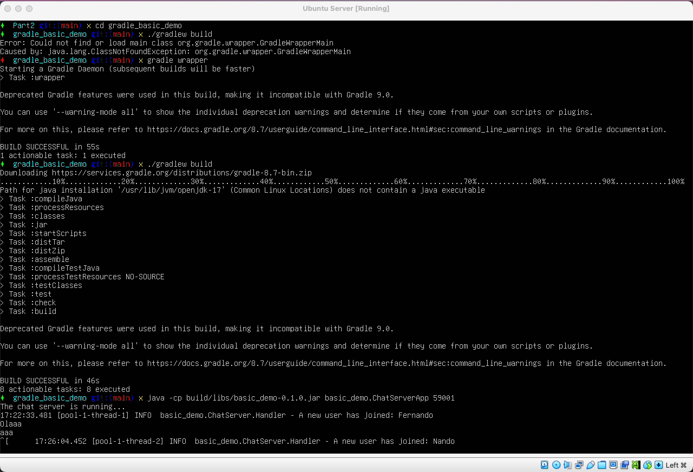
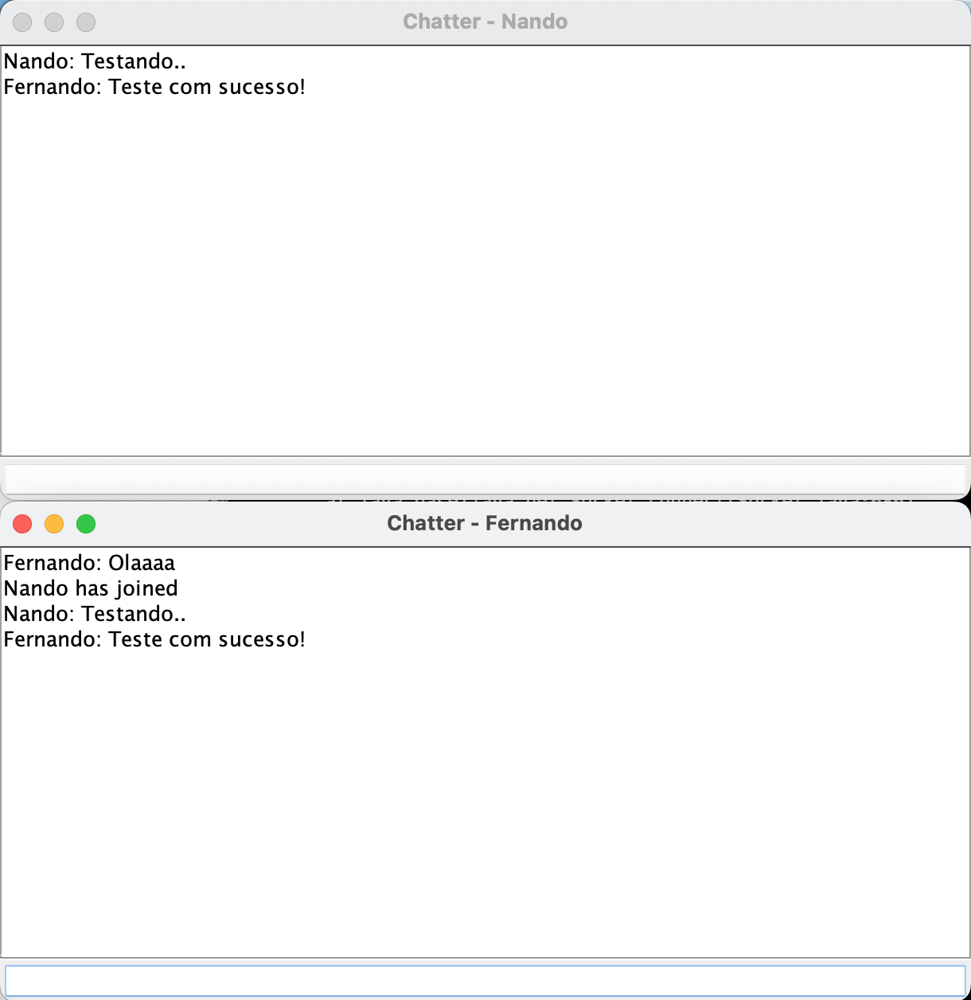
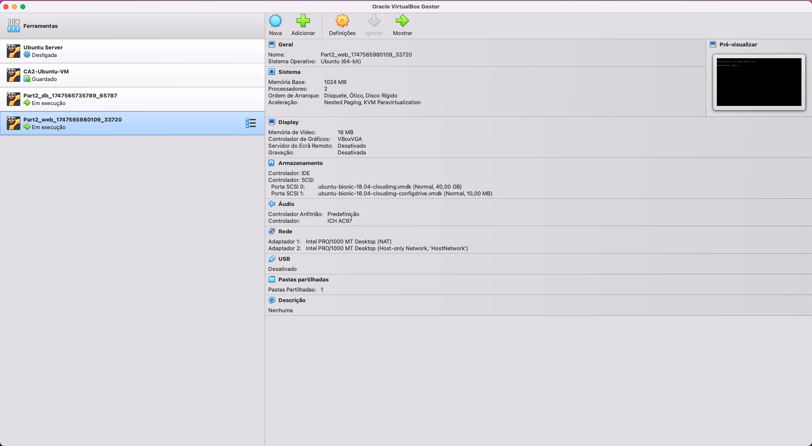
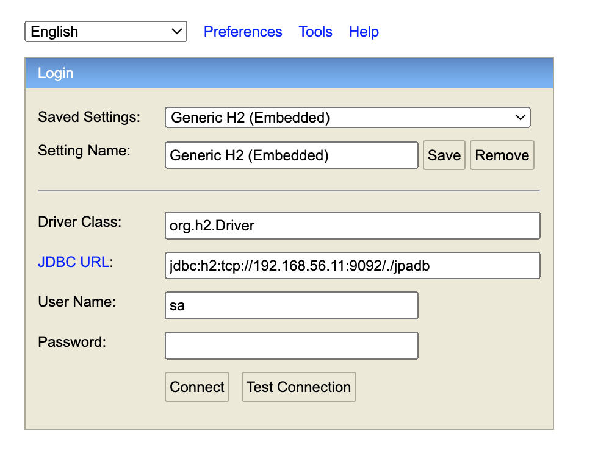

# DevOps Assignment - CA1

**Author:** Fernando Moreira

**Date:** 24/02/2025

**Discipline:** DevOps

**Program:** SWitCH DEV

**Institution:** ISEP - Instituto Superior de Engenharia do Porto

## Table of Contents

- [Introduction](#introduction)
- [Part 1: Virtualization With VirtualBox ](#part-1-virtualization-with-virtualbox)
- [Create a Virtual Machine](#create-a-virtual-machine)
- [Network Configuration](#network-configuration)
- [Install Project Dependencies](#install-project-dependencies)
- [Cloning the Repository](#cloning-the-repository)
- [Running the Basic Spring Boot Tutorial Project - Maven](#running-the-basic-spring-boot-tutorial-project-maven)
- [Running the Basic Spring Boot Tutorial Project - Gradle](#running-the-basic-spring-boot-tutorial-project-gradle)
- [Part 2: Virtualization With Vagrant ](#part-1-virtualization-with-vagrant)
- [Installing Vagrant](#installing-vagrant)
- [Cloning the Initial repository](#cloning-the-initial-repository)
- [Vagrantfile Configuration](#vagrantfile-configuration)
- [Spring Boot and H2 integration](#spring-boot-and-h2-integration)
- [React Frontend Adjustment](#react-frontend-adjustment)
- [Running the Project](#running-the-project)
- [Alternative Solution](#alternative-solution)
- [Conclusion](#conclusion)

## Introduction

This technical report covers the setup and configuration of a virtualized Ubuntu Server environment using VirtualBox and Vagrant to run Java Spring Boot projects. The goal was to recreate a development environment from scratch, including cloning GitHub repositories, installing dependencies, and running projects like spring-boot-tutorial and gradle_basic_demo. Networked applications such as web services and client-server chat systems were tested between the VM (server) and host machine (client).

The report also details configuring Vagrant to run a Spring Boot application connected to an H2 database and explores an alternative setup using VMware with Vagrant. Challenges encountered and solutions applied are documented to provide hands-on experience with isolated, reproducible software environments.
## Part 1: Virtualization with VirturalBox

### Create a Virtual Machine (VM)

- I began by downloading VirtualBox from https://www.virtualbox.org/wiki/Downloads and proceeding with its installation.

- After launching VirtualBox, I selected "New" to create a virtual machine. I assigned a name to the VM and chose the corresponding operating system type and version.

- I allocated 4096 MB of RAM to the virtual machine for stable performance and created a virtual hard disk to store system files and data.

- Within the VM’s configuration menu, I accessed the Storage tab and linked the ISO image of the Ubuntu minimal installation to the optical drive. I then booted up the VM and completed the OS installation by following the step-by-step instructions.


- 
- Once the system was set up, I installed the VirtualBox Guest Additions to enhance compatibility and functionality.

- To prepare the environment, I configured the VM for an Ubuntu 24.04.2 minimal system. The network setup included two adapters: the first one used NAT mode to enable internet access, and the second was configured as a Host-Only Adapter (vboxnet0) to allow direct communication between the VM and the host computer.




### Network Configuration

After completing the initial setup of the virtual machine, I proceeded to configure the network and key services to improve the VM's usability and connectivity.

- I navigated to the VirtualBox main menu and opened the **Host Network Manager** by going to `File` -> `Tools` ->  `Network Manager`.
- By clicking the `Create` button, I added a new **Host-only Network**, which appeared in the list. This step enabled me to define a network name later within the VM’s network settings.
- With the **Host-only Adapter** (vboxnet0) in place, I reviewed the subnet range, which was `192.168.56.5/24`. I manually selected `192.168.56.1` as the static IP for the VM's secondary network adapter, ensuring it was part of the correct subnet.
- Once the VM was running, I updated the system's package list using `sudo apt update`.
- To support network configurations, I installed the necessary utilities via `sudo apt install net-tools`.
- I configured the second network interface with the static IP by editing the Netplan file: `sudo nano /etc/netplan/01-netcfg.yaml`. The file was updated to the following content:

```yaml
network:
  version: 2
  renderer: networkd
  ethernets:
    enp0s3:
      dhcp4: yes
    enp0s8:
      addresses:
        - 192.168.56.5/24
```

After saving the configuration, I executed sudo netplan apply to implement the changes.

To enable remote access, I installed the OpenSSH server with sudo apt install openssh-server. Then, I modified /etc/ssh/sshd_config to allow password-based logins by uncommenting the line PasswordAuthentication yes. The SSH service was restarted using sudo service ssh restart.

For file transfer capabilities, I installed an FTP server by running sudo apt install vsftpd. I enabled file writing by modifying the configuration file /etc/vsftpd.conf, ensuring the line write_enable=YES was uncommented. The changes took effect after restarting the service with sudo service vsftpd restart.

### Install Project Dependencies

Once the virtual machine was properly configured and network access was confirmed, I proceeded to install the essential development tools needed for Java-based projects.

I started by ensuring the system was fully updated. This included refreshing the list of available packages and applying any pending upgrades with the following commands:

```bash
sudo apt update
sudo apt upgrade
```

With the system up-to-date, I installed `Git`, which is crucial for version control and source code collaboration:
```bash
sudo apt install git
```

To support Java development, I added both the Java Development Kit `JDK` and the Java Runtime Environment `JRE` to the system:
```bash
sudo apt install openjdk-17-jdk openjdk-17-jre
```

Next, I installed `Maven`, which handles project dependencies and automates the build process for Java applications:
```bash
sudo apt install maven
```

Installing `Gradle` required a few additional steps since it wasn't directly available in the preferred version through the package manager:
```bash
wget https://services.gradle.org/distributions/gradle-8.7-bin.zip
sudo mkdir /opt/gradle
sudo unzip -d /opt/gradle gradle-8.7-bin.zip
```

At this point, the virtual machine was fully equipped with the necessary tools to compile, build, and run Java projects.

Finally, I verified the installation and functionality of each tool by checking their versions:
```bash
git --version
java --version
mvn --version
gradle --version
```

### Cloning the Repository

To bring my personal repository into the virtual machine, I first needed to establish a secure SSH connection between the VM and GitHub. Below are the steps I followed:

I began by creating a new SSH key pair on the virtual machine to enable secure interactions with GitHub. This was done via the terminal with the command:

```bash
ssh-keygen -t ed25519 -C "myemail@example.com"
```

Once the key pair was generated, I needed to associate the public key with my GitHub account. I displayed the contents of the public key file using:
```bash
cat ~/.ssh/id_ed25519.pub
```

After copying the key, I signed in to GitHub, went to Settings > SSH and GPG keys, clicked on New SSH key, and pasted the key into the input field before saving it. This step authorized the VM to communicate securely with GitHub.

With SSH access in place, I proceeded to clone the repository directly into a chosen folder within the VM by executing:
```bash
git clone https://github.com/fmoreira13/devops-24-25-1241905.git
```

This successfully downloaded my repository onto the virtual machine, making it ready for development or further configuration.

### Running the Basic Spring Boot Tutorial Project - Maven

In this stage, I executed the basic Spring Boot tutorial project, which was a requirement from earlier assignments. The objective was to build and run the project within the virtual machine environment previously configured.

First, I navigated to the project’s root folder where all necessary Spring Boot files were located. This directory holds the structure of the application.


To verify external accessibility—such as from the host system or other devices connected to the same network—I checked the VM’s IP address using:
```bash
ifconfig
```

To start the application, I ran the following command from inside the project folder:
```bash
./mvnw spring-boot:run
```



Once the IP was confirmed, I accessed the application in host browser by visiting:
```
http://192.168.56.5:8080/
```



The application launched without issues, displaying the default homepage as expected. This confirmed that the backend was running properly and that Spring Boot was serving the application correctly.

To document the process, I took a screenshot of the application's home page as it appeared in the browser after successful deployment.

### Running the Basic Spring Boot Tutorial Project - Gradle

To execute the `gradle_basic_demo project, I followed a process that involved both the virtual machine and the host system environments.

First, inside the virtual machine, I navigated to the gradle_basic_demo directory. From there, I compiled the project using the command:
```bash
./gradlew build
```

Next, the chat server was started using the command:
```bash
java -cp build/libs/basic_demo-0.1.0.jar basic_demo.ChatServerApp 59001
```



Because the VM was running Ubuntu Server without a graphical interface, I couldn’t launch GUI-based applications like the chat client within it. As a workaround, I switched to my host machine, opened a terminal, and navigated to a local clone of the same project directory.

On the host system, I started the chat client using the following command:
```bash
./gradlew runClient --args="192.168.56.5 59001"
```

By specifying the VM's IP address and the correct port number, I enabled the chat client on the host to connect with the server running in the VM. I launched two separate chat windows from the host, successfully demonstrating real-time message exchange between them. This confirmed that the server-client interaction was functioning properly. To document the result, I captured a screenshot showing the live conversation and network communication.



## Part 2 - Virtualization with Vagrant

### Setting Up the Vagrant Environment

To prepare the virtualized development environment with Vagrant, I completed the following steps:

### Installing Vagrant

First, I accessed the [official Vagrant website](https://www.vagrantup.com/) and downloaded the latest version compatible with my operating system. Once downloaded, I executed the installer and followed the guided setup process. The installation was quick and required no advanced configuration.

#### Verifying the Installation

After installation, I confirmed that Vagrant was successfully installed by running the following command in the terminal:

```bash
vagrant --version
```

This returned the currently installed version of Vagrant, confirming that the tool was correctly set up on my system.

### Cleaning Up the Repository

To avoid committing unnecessary files to version control, I updated the .gitignore file in my project directory. The following entries were added to exclude the Vagrant working directory and any generated .war files:

```gitignore
.vagrant/
*.war
```
This helps keep the repository clean and ensures only relevant source files are tracked.

### Cloning the Initial Repository

To begin, I cloned the base Vagrant repository to obtain all necessary configuration files. This repository includes a predefined Vagrant setup that simplifies the creation of virtual machines.

```bash
git clone https://bitbucket.org/pssmatos/vagrant-multi-spring-tut-demo/
```

#### Copying the Vagrantfile
After cloning, I copied the Vagrantfile from the cloned project to my local project directory to use the base configuration as a starting point.

```bash
cp -r ~/IdeaProjects/vagrant-multi-spring-tut-demo/ ~/IdeaProjects/DevOps/devops-24-25-1241905/CA2/Part2 
```
This ensures that the virtual environment configuration is now present in my working directory.

### Vagrantfile Configuration
The Vagrantfile defines how the virtual machines should be created and provisioned. After copying the base file, I made several changes to align it with the requirements of this specific project.

#### Key Changes Made

- Updated Repository URL: Changed the Git repository URL to point to my project.

- Adjusted File Paths: Updated path references to ensure correct navigation within the VM.

- Boot Command: Added a Gradle command to automatically launch the Spring Boot application.

- Java Version: Replaced the default Java version with OpenJDK 17.

#### Modified Vagrantfile

```ruby
# See: https://manski.net/2016/09/vagrant-multi-machine-tutorial/
# for information about machine names on private network
Vagrant.configure("2") do |config|
  config.vm.box = "ubuntu/bionic64"

  # This provision is common for both VMs
  config.vm.provision "shell", inline: <<-SHELL
    sudo apt-get update -y
    sudo apt-get install -y iputils-ping avahi-daemon libnss-mdns unzip \
        openjdk-17-jdk-headless
    # ifconfig
  SHELL

  #============
  # Configurations specific to the database VM
  config.vm.define "db" do |db|
    db.vm.box = "ubuntu/bionic64"
    db.vm.hostname = "db"
    db.vm.network "private_network", ip: "192.168.56.11"

    # We want to access H2 console from the host using port 8082
    # We want to connet to the H2 server using port 9092
    db.vm.network "forwarded_port", guest: 8082, host: 8082
    db.vm.network "forwarded_port", guest: 9092, host: 9092

    # We need to download H2
    db.vm.provision "shell", inline: <<-SHELL
      wget https://repo1.maven.org/maven2/com/h2database/h2/1.4.200/h2-1.4.200.jar
    SHELL

    # The following provision shell will run ALWAYS so that we can execute the H2 server process
    # This could be done in a different way, for instance, setiing H2 as as service, like in the following link:
    # How to setup java as a service in ubuntu: http://www.jcgonzalez.com/ubuntu-16-java-service-wrapper-example
    #
    # To connect to H2 use: jdbc:h2:tcp://192.168.33.11:9092/./jpadb
    db.vm.provision "shell", :run => 'always', inline: <<-SHELL
      java -cp ./h2*.jar org.h2.tools.Server -web -webAllowOthers -tcp -tcpAllowOthers -ifNotExists > ~/out.txt &
    SHELL
  end

  #============
  # Configurations specific to the webserver VM
  config.vm.define "web" do |web|
    web.vm.box = "ubuntu/bionic64"
    web.vm.hostname = "web"
    web.vm.network "private_network", ip: "192.168.56.10"

    # We set more ram memmory for this VM
    web.vm.provider "virtualbox" do |v|
      v.memory = 1024
    end

    # We want to access tomcat from the host using port 8080
    web.vm.network "forwarded_port", guest: 8080, host: 8080

    web.vm.provision "shell", inline: <<-SHELL, privileged: false
      # sudo apt-get install git -y
      # sudo apt-get install nodejs -y
      # sudo apt-get install npm -y
      # sudo ln -s /usr/bin/nodejs /usr/bin/node
      # sudo apt install -y tomcat9 tomcat9-admin
      # If you want to access Tomcat admin web page do the following:
      # Edit /etc/tomcat9/tomcat-users.xml
      # uncomment tomcat-users and add manager-gui to tomcat user

      # Change the following command to clone your own repository!
      git clone https://github.com/fmoreira13/devops-24-25-1241905.git
      cd devops-24-25-1241905/CA1/Part3/react-and-spring-data-rest-basic
      chmod u+x gradlew
      ./gradlew clean build
      ./gradlew bootRun
      # To deploy the war file to tomcat9 do the following command:
      # sudo cp ./build/libs/basic-0.0.1-SNAPSHOT.war /var/lib/tomcat9/webapps
    SHELL
  end
end
```

### Spring Boot and H2 Integration

#### application.properties Configuration

To enable the Spring Boot application to connect to the H2 database running on the separate VM, I configured the application.properties file as follows:
```properties
server.servlet.context-path=/basic-0.0.1-SNAPSHOT
spring.data.rest.base-path=/api

spring.datasource.url=jdbc:h2:tcp://192.168.56.11:9092/./jpadb;DB_CLOSE_DELAY=-1;DB_CLOSE_ON_EXIT=FALSE
spring.datasource.driverClassName=org.h2.Driver
spring.datasource.username=sa
spring.datasource.password=

spring.jpa.database-platform=org.hibernate.dialect.H2Dialect

spring.h2.console.enabled=true
spring.h2.console.path=/h2-console
spring.h2.console.settings.web-allow-others=true
```
These settings ensure that the application connects to the remote H2 database, while also enabling access to the H2 console through the web interface.

### React Frontend Adjustment

#### Updating App.js
To ensure the frontend interacts properly with the new backend context path, I updated the App.js file inside the React project:

```javascript
		client({ method: 'GET', path: 'http://192.168.56.11:8080/basic-0.0.1-SNAPSHOT/api/employees' }).done(response => {
```
This change ensures that the frontend communicates correctly with the Spring Boot API exposed on the new context path.

### Running the Project

Before starting, I verified that VirtualBox was properly installed and that the Git repository I intended to clone was publicly accessible. Then, I navigated to the project folder and executed the following command:

```bash
vagrant up
```
This command boots up two VMs configured in the Vagrantfile:

- A database VM (db) running Ubuntu at IP 192.168.56.11, hosting the H2 database server accessible on port 9092 and its web console on port 8082, both forwarded to the host machine.
- A webserver VM (web) running Ubuntu at IP 192.168.56.10, running the Spring Boot app on port 8080, also forwarded to the host.

The H2 database configuration in the Spring Boot app uses the remote H2 server URL:
```arduino
jdbc:h2:tcp://192.168.56.11:9092/./jpadb;DB_CLOSE_DELAY=-1;DB_CLOSE_ON_EXIT=FALSE
```

The Spring Boot server servlet context path is set to /basic-0.0.1-SNAPSHOT and the Spring Data REST base path is /api. Therefore, the full API endpoint for employees is:
```bash
http://192.168.56.11:8080/basic-0.0.1-SNAPSHOT/api/employees
```

In the React frontend, the API call uses this full URL to fetch employee data, as shown in the componentDidMount lifecycle method:
```javascript
client({ method: 'GET', path: 'http://192.168.56.11:8080/basic-0.0.1-SNAPSHOT/api/employees' })
  .done(response => {
    this.setState({ employees: response.entity._embedded.employees });
  });
```




Once the VMs were running, I opened my browser and navigated to the Spring Boot app at:
```bash
http://localhost:8080/basic-0.0.1-SNAPSHOT/
```

To interact with the H2 database, I accessed the H2 console at:
```bash
http://localhost:8082/h2-console
```

Using the JDBC URL configured for the remote H2 server:
```arduino
jdbc:h2:tcp://192.168.56.11:9092/./jpadb
```



### Alternative Solution

This section explores using VMware as an alternative virtualization platform to VirtualBox. Below is a detailed comparison between VMware and VirtualBox, followed by instructions on how to integrate VMware with Vagrant to fulfill the requirements of this assignment.

#### VMware vs. VirtualBox: Feature Comparison

| Feature               | VirtualBox                                   | VMware (Workstation/Fusion)                     |
|-----------------------|---------------------------------------------|------------------------------------------------|
| **Type**              | Free, open-source hypervisor                 | Commercial, professional-grade hypervisor       |
| **User Interface**    | Simple and user-friendly GUI                  | Robust but more complex GUI                      |
| **Guest OS Support**  | Supports a broad range of operating systems  | Also supports many OSes, with better enterprise integration |
| **Advanced Features** | Limited (basic snapshots and cloning)        | Rich features like snapshots, cloning, VM sharing |
| **Performance**       | Adequate, but can slow down with heavy loads | High performance, optimized for complex workloads |
| **Cost**              | Free                                           | Requires paid license after trial                |
| **Learning Curve**    | Easier for beginners                           | More complex due to enterprise features          |


#### Steps to Use VMware with Vagrant

To use VMware as the provider with Vagrant, follow these steps:

1. Install the Vagrant VMware Utility: This component enables Vagrant to control VMware virtual machines.
   
This is an example for linux.
```bash
wget https://releases.hashicorp.com/vagrant-VMware-utility/1.0.14/vagrant-VMware-utility_1.0.14_x86_64.deb
sudo dpkg -i vagrant-VMware-utility_1.0.14_x86_64.deb
```

2. Add the VMware Plugin to Vagrant: This plugin enables Vagrant to interact with VMware providers.
```bash
vagrant plugin install vagrant-VMware-desktop
```

3. Configure Your Vagrantfile: Specify VMware as the provider and configure VM resources like memory and CPU cores.
```ruby
Vagrant.configure("2") do |config|
  config.vm.box = "hashicorp/bionic64"
  config.vm.provider "vmware_desktop" do |v|
    v.vmx["memsize"] = "1024"
    v.vmx["numvcpus"] = "2"
  end
end
```

By switching to VMware as the virtualization provider with Vagrant, you gain access to enhanced performance and enterprise-level features. This setup is particularly beneficial when working with complex or resource-demanding development environments.

This alternative method aligns well with the goal of creating a more powerful and production-like virtualization environment for improved development workflow.


### Conclusion

This report summarizes the setup and deployment of a virtual environment using VirtualBox and Vagrant for Assignment 2. It involved creating and configuring virtual machines, deploying development tools, and running Spring Boot applications connected to an H2 database. Challenges like host-guest network communication were addressed, providing practical insights into virtualization in DevOps.

Additionally, an alternative VMware setup with Vagrant was explored, highlighting key differences and advantages over VirtualBox. These experiences have deepened my understanding of managing virtualized environments and software deployment in real-world scenarios.


