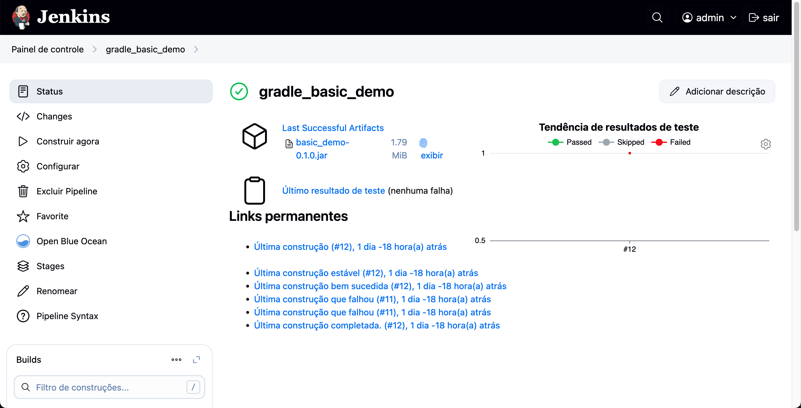

# DevOps Assignment - CA1

**Author:** Fernando Moreira

**Date:** 25/05/2025

**Discipline:** DevOps

**Program:** SWitCH DEV

**Institution:** ISEP - Instituto Superior de Engenharia do Porto

## Table of Contents

- [Introduction](#introduction)


## Introduction

In this hands-on exercise, we developed two fully automated CI/CD pipelines in Jenkins, covering every step from code retrieval to deployment:

#### Gradle Basic Demo
A simple Java application built with Gradle. The pipeline automates the following tasks:

- Checking out the source code from GitHub
- Building and assembling the project using `./gradlew clean assemble`
- Running unit tests with JUnit 5 and publishing XML test reports to Jenkins
- Archiving the generated JAR artifact

#### React + Spring Data REST
A full-stack application combining a React frontend and a Spring Boot backend. This pipeline includes:

- Source code checkout from GitHub
- Dockerfile creation for the Spring Boot backend service
- Full build process:
    - Bundling the frontend with Webpack
    - Building the backend bootJar via Gradle
- Executing unit tests with JUnit 5
- Generating Javadoc documentation and publishing HTML reports in Jenkins
- Archiving the backend JAR artifact
- Building and pushing the Docker image to Docker Hub

To enable Docker commands within Jenkins, we ran Jenkins inside a custom Docker image pre-installed with the Docker CLI and configured secure Docker Hub credentials. This README outlines each stage of the pipelines along with the configuration steps necessary to achieve a fully automated build-test-deploy workflow.

## Setup & Prerequisites

Before configuring the pipelines, ensure you have the following tools and settings prepared:

#### Git
Essential for cloning repositories.  
Verify installation by running:
```bash
git --version
```

#### Docker
Required to build and run container images, including the Jenkins server container.
Check installation with:
```bash
docker --version
```

#### Jenkins
We deployed Jenkins inside a Docker container based on jenkins/jenkins:lts with Docker CLI pre-installed.
Access Jenkins at http://localhost:8080 and complete the initial setup process, which includes unlocking Jenkins and installing the suggested plugins.

#### JDK 17 & Gradle Wrapper
Both the Gradle demo and the Spring Boot application require JDK 17.
Each repository comes with its own Gradle wrapper, so installing Gradle globally is unnecessary.
Verify Gradle wrapper locally by running:
```bash
./gradlew --version
```

#### Required Jenkins Plugins
Pipeline: Declarative — enables Jenkinsfile support

Git — handles source code checkout

HTML Publisher — publishes Javadoc reports inside Jenkins

JUnit — displays test results on the Jenkins dashboard

Docker Pipeline — allows usage of docker.build() and docker.withRegistry() in pipelines

#### Docker Hub Credentials
Create a Jenkins credential of type "Username with password" with the ID dockerhub-creds-id.
This credential is used by the pipeline to push the Spring Boot Docker image to Docker Hub.

Once all these prerequisites are fulfilled, you can proceed to clone the repositories and execute the Jenkins pipelines that automate source checkout, building, testing, documentation generation, artifact archiving, and Docker image publishing.

## Part 1: CI/CD Pipeline for the Gradle Basic Demo

In this initial exercise, we implemented a Declarative Pipeline in Jenkins to automate the build, testing, and artifact archiving of the Gradle Basic Demo project (found in `CA1/part2/gradle_basic_demo`). The entire process is defined within a Jenkinsfile stored in the project repository.

```jenkinsfile
pipeline {
    agent any
    tools {
        jdk 'java17'
      }
    stages {
        stage('Checkout') {
            steps {
                echo 'Clonando o repositório público...'
                git url: 'https://github.com/fmoreira13/devops-24-25-1241905.git', branch: 'main'
            }
        }
        stage('Assemble') {
            steps {
                dir('CA1/Part2/gradle_basic_demo') {
                    echo 'Compilando a aplicação...'
                    sh 'chmod +x gradlew'
                    sh './gradlew clean assemble'
                }
            }
        }
        stage('Test') {
            steps {
                dir('CA1/Part2/gradle_basic_demo') {
                    echo 'Executando testes...'
                    sh './gradlew test'
                    junit '**/build/test-results/**/*.xml'
                }
            }
        }
        stage('Archive') {
            steps {
                dir('CA1/Part2/gradle_basic_demo') {
                    echo 'Arquivando artefatos...'
                    archiveArtifacts artifacts: 'build/libs/*.jar', fingerprint: true
                }
            }
        }
    }
}
```

#### Source Checkout
Fetched the `main` branch from GitHub into the Jenkins workspace.

#### Build (Assemble)
- Granted execution permissions to the Gradle wrapper.
- Executed `./gradlew clean assemble` to compile the source code, process resources, and generate the JAR file.

#### Testing
- Ran unit tests using `./gradlew test`, which compiles and executes all JUnit tests.
- Captured XML test reports, allowing Jenkins to determine build success or failure and display detailed test outcomes.

#### Artifact Archiving
- Saved the resulting `.jar` file under **Build Artifacts** in Jenkins.
- Enabled artifact fingerprinting to track its usage across other builds or pipelines.

### How to Execute the Pipeline

#### Create a Pipeline Job
In Jenkins:
1. Click **New Item** → Select **Pipeline**
2. In the **Pipeline** section, set **Definition** to *Pipeline script from SCM*
3. Choose **Git** as the SCM and set the branch to `main`
4. Define the **Script Path** as:  `CA1/part2/gradle_basic_demo/Jenkinsfile`


#### Run the Build
- Click **Build Now** to trigger the pipeline.
- Monitor the console output to follow each stage of the process.
- Once complete, test results will be shown under the **Tests** tab, and the generated JAR will appear under **Last Successful Artifacts**.

This pipeline ensures that every commit pushed to the `main` branch is automatically validated, tested, and packaged. It delivers rapid feedback and consistently produces reliable build artifacts ready for further stages in the development lifecycle.




